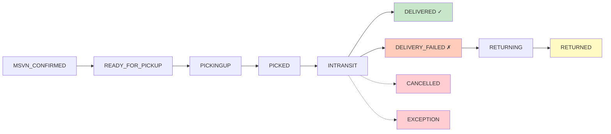
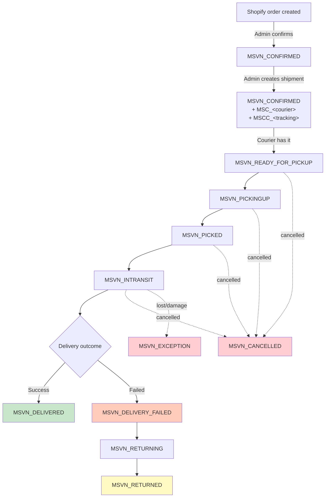
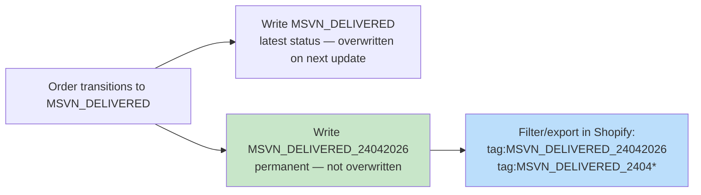

# Meowship Order Tag Reference

How Meowship Plus writes status tags onto Shopify orders, when each tag fires, and what they mean.

---

## TL;DR

Shopify orders carry one `MSVN_*` status tag that reflects the **latest** courier event. The tag is **overwritten in place** on every update — only the current state is visible; previous states are not preserved on the tag itself.

**The 5 things merchants need to know:**

1. **One MSVN tag at a time.** A new status replaces the old one. Historical states are not kept on the tag.
2. **Real-time.** Tags update from courier webhooks the moment the courier reports a status change — not batched daily.
3. **No delivery date on the tag.** There is currently no way to filter orders by delivery date using tags alone. A date-stamped tag is being planned (see [Proposed: date-stamped delivery tag](#proposed-date-stamped-delivery-tag)).
4. **Cancelled shipments reset to `MSVN_CONFIRMED`.** When a shipment is cancelled at the courier and auto-cancel is enabled, the order returns to the "confirmed / awaiting shipment" state so it can be re-shipped.
5. **Only the latest shipment is visible.** On an exchange or re-ship, the new shipment's status overwrites the previous `MSVN_DELIVERED`.

---

## FAQ

<b>"What's the difference between `MSVN_PICKED` and `MSVN_INTRANSIT`?"</b>

They represent two distinct stages in a courier's workflow:

- **`MSVN_PICKED`** = the driver has just collected the parcel from the sender. The parcel is in the driver's possession but has **not yet entered the courier's logistics pipeline**. This is a short-lived state.
- **`MSVN_INTRANSIT`** = the parcel is **inside the courier's network**, moving toward the recipient. This covers everything from sorting at a hub, transport between hubs/cities, all the way through the final "out for delivery" leg.

How the distinction plays out per courier type:

| Courier type | `MSVN_PICKED` means | `MSVN_INTRANSIT` means |
|---|---|---|
| Multi-day network couriers (GHN, ViettelPost, GHTK) | Collected from sender, not yet at a sorting hub | At sorting hub, between hubs, or out for delivery — can last hours to days |
| Same-day intra-city (Ahamove, GrabExpress) | Driver just picked up, about to head to drop-off | Driver actively en route to recipient — usually minutes |

Why it matters to merchants:
- `MSVN_PICKED` tells you the pickup is **complete** — useful for confirming the driver actually showed up.
- `MSVN_INTRANSIT` tells you the parcel is **moving** — if an order stays on `MSVN_INTRANSIT` unusually long for a network courier (days across regions), that's normal; for same-day couriers (hours), it may indicate a problem.

Note: Ahamove does not use `MSVN_INTRANSIT` at all — it jumps directly from `MSVN_PICKINGUP` to the terminal state (delivered / failed / etc.) because a single driver handles the whole trip within one city.

<b>"What's the difference between `MSVN_DELIVERY_FAILED`, `MSVN_RETURNING`, and `MSVN_RETURNED`?"</b>

These are three stages of the same flow:
- `MSVN_DELIVERY_FAILED` = the delivery attempt did not succeed (customer refused, not home, wrong address, etc.).
- `MSVN_RETURNING` = the parcel is currently on its way back to the sender.
- `MSVN_RETURNED` = the parcel is physically back at the sender.

`MSVN_RETURNED` is **not** "customer returned a delivered order" — the app only tracks the outbound shipment, not post-delivery returns.

<b>"I re-shipped an exchange and the original delivery date is gone. Why?"</b>

Every new shipment replaces the previous `MSVN_DELIVERED` tag with `MSVN_INTRANSIT`. Only the latest shipment's status is visible on tags. The date-stamped tag feature is designed to preserve historical delivery dates — see below.

<b>"Why do I sometimes see `MSVN_CONFIRMED` instead of `MSVN_CANCELLED` after a shipment is cancelled?"</b>

If auto-cancel is enabled in your store settings, a cancelled shipment automatically resets the order back to `MSVN_CONFIRMED` so you can re-ship without manually clearing the cancelled tag. This is by design — it returns the order to a ready-to-ship state.

If you need to track which orders were previously cancelled, use the in-app notifications or the shipment history view.

<b>"How do I filter orders by delivery date today?"</b>

You can't filter by delivery date using tags today. The delivery date is recorded server-side but not mirrored onto the Shopify order tag. This is what the proposed date-stamped tag feature addresses.

---

## Tag reference

| Tag | What it means | When it's written |
|---|---|---|
| `MSVN_CONFIRMED` | Order confirmed, ready to ship | Admin clicks confirm / shipment cancelled and reset |
| `MSVN_READY_FOR_PICKUP` | Courier has the shipment, waiting for a driver | Courier webhook |
| `MSVN_PICKINGUP` | Driver is on the way / has been assigned | Courier webhook |
| `MSVN_PICKED` | Driver has collected the parcel from the sender (not yet in the courier network) | Courier webhook |
| `MSVN_INTRANSIT` | Parcel has entered the courier's network — sorting, inter-hub transport, or out for delivery | Courier webhook |
| `MSVN_DELIVERED` | ✅ Successfully delivered to the recipient | Courier webhook |
| `MSVN_DELIVERY_FAILED` | ❌ Delivery attempt failed | Courier webhook |
| `MSVN_RETURNING` | Parcel is on the return leg back to the sender | Courier webhook |
| `MSVN_RETURNED` | Parcel is fully back at the sender | Courier webhook |
| `MSVN_CANCELLED` | Shipment cancelled at the courier | Courier webhook |
| `MSVN_EXCEPTION` | Lost / damaged | Courier webhook (GHN only) |

**Other tags Meowship writes:**

| Tag | What it means |
|---|---|
| `MSC_<COURIER>` | Which courier is handling this order (e.g. `MSC_GIAOHANGNHANH`, `MSC_VIETTELPOST`, `MSC_GIAOHANGTIETKIEM`, `MSC_GRABEXPRESS`, `MSC_AHAMOVE`) |
| `MSCC_<code>` | Courier tracking code for this shipment |
| `MSO_CONFIRMED` | Permanent marker: this order has been confirmed at least once (useful for filtering) |
| `MSO_ORDER_CREATED` | Marker: this order currently has an active shipment |

---

## Order lifecycle (full)

**Timing:** every transition after `MSVN_CONFIRMED` is driven by real-time webhooks from the courier. The moment the courier marks a status change, the Shopify order tag updates.

---

## Native courier status → Meowship tag

The mapping from each courier's native status codes to Meowship tags.

<b>GiaoHangNhanh (GHN)</b>

| Native | Meowship tag |
|---|---|
| `ready_to_pick` | `MSVN_READY_FOR_PICKUP` |
| `picking` | `MSVN_PICKINGUP` |
| `picked`, `money_collect_picking` | `MSVN_PICKED` |
| `storing`, `transporting`, `sorting`, `delivering`, `money_collect_delivering` | `MSVN_INTRANSIT` |
| `delivered` | `MSVN_DELIVERED` |
| `delivery_fail` | `MSVN_DELIVERY_FAILED` |
| `waiting_to_return`, `return`, `return_transporting`, `return_sorting`, `returning`, `return_fail` | `MSVN_RETURNING` |
| `returned` | `MSVN_RETURNED` |
| `cancel` | `MSVN_CANCELLED` |
| `lost`, `damage` | `MSVN_EXCEPTION` |

<b>ViettelPost (VTP)</b>

| Native | Meowship tag |
|---|---|
| `-100` | `MSVN_READY_FOR_PICKUP` |
| `100`, `102`, `103`, `104`, `-108`, `-109`, `-110` | `MSVN_PICKINGUP` |
| `105` | `MSVN_PICKED` |
| `200`, `202`, `300`, `320`, `400`, `500`, `506`, `508`, `509`, `550`, `570` | `MSVN_INTRANSIT` |
| `501` | `MSVN_DELIVERED` |
| `507` | `MSVN_DELIVERY_FAILED` |
| `502`, `505`, `515` | `MSVN_RETURNING` |
| `504` | `MSVN_RETURNED` |
| `107`, `201`, `503` | `MSVN_CANCELLED` |

<b>GiaoHangTietKiem (GHTK)</b>

| Native | Meowship tag |
|---|---|
| `2` | `MSVN_READY_FOR_PICKUP` |
| `8`, `12` | `MSVN_PICKINGUP` |
| `3` | `MSVN_PICKED` |
| `4`, `10`, `123`, `127`, `128`, `410` | `MSVN_INTRANSIT` |
| `6`, `45` | `MSVN_DELIVERED` |
| `9`, `49` | `MSVN_DELIVERY_FAILED` |
| `13`, `20` | `MSVN_RETURNING` |
| `11`, `21` | `MSVN_RETURNED` |
| `-1`, `7` | `MSVN_CANCELLED` |

<b>Ahamove</b>

Ahamove is a same-day intra-city courier with a simpler status model than multi-day networks.

| Native | Meowship tag |
|---|---|
| `IDLE`, `ASSIGNING` | `MSVN_READY_FOR_PICKUP` |
| `ACCEPTED`, `IN PROCESS` | `MSVN_PICKINGUP` |
| `COMPLETED` + delivery outcome = completed | `MSVN_DELIVERED` |
| `COMPLETED` + delivery outcome = failed | `MSVN_DELIVERY_FAILED` |
| `COMPLETED` + delivery outcome = returning | `MSVN_RETURNING` |
| `COMPLETED` + delivery outcome = returned | `MSVN_RETURNED` |
| `CANCELLED` | `MSVN_CANCELLED` |

<b>GrabExpress</b>

| Native | Meowship tag |
|---|---|
| `QUEUEING`, `ALLOCATING`, `PENDING_PICKUP` | `MSVN_READY_FOR_PICKUP` |
| `PICKING_UP` | `MSVN_PICKINGUP` |
| `PENDING_DROP_OFF` | `MSVN_PICKED` |
| `IN_DELIVERY` | `MSVN_INTRANSIT` |
| `COMPLETED` | `MSVN_DELIVERED` |
| `FAILED` | `MSVN_DELIVERY_FAILED` |
| `IN_RETURN` | `MSVN_RETURNING` |
| `RETURNED` | `MSVN_RETURNED` |
| `CANCELED` | `MSVN_CANCELLED` |

---

## Custom order attributes

In addition to tags, Meowship writes these custom attributes on each order for programmatic access:

| Attribute | Value |
|---|---|
| `msa_confirmed_at` | Timestamp when the order was confirmed in Meowship |
| `msa_order_created_at` | Timestamp when the shipment was created at the courier |
| `msa_courier_name` | Courier handling this order |
| `msa_tracking_code` | Courier-native tracking number |
| `msa_courier_status` | The courier's native status code |

---

## Proposed: date-stamped delivery tag

A feature request under review: add a second tag on delivery that is never overwritten, so merchants can filter and export orders by delivery date directly from Shopify admin.

**Open design decisions** (feedback welcome):

- **Date format**: `ddmmyyyy` (e.g. `24042026`) vs `yyyy-mm-dd` (e.g. `2026-04-24`). The latter sorts naturally in Shopify filters.
- **Timezone**: Asia/Ho_Chi_Minh (UTC+7).
- **Scope**: delivered-only, or also for other terminal states (returned, intransit)?
- **On exchanges**: keep both the original and new delivery dates, or overwrite with the newest?
